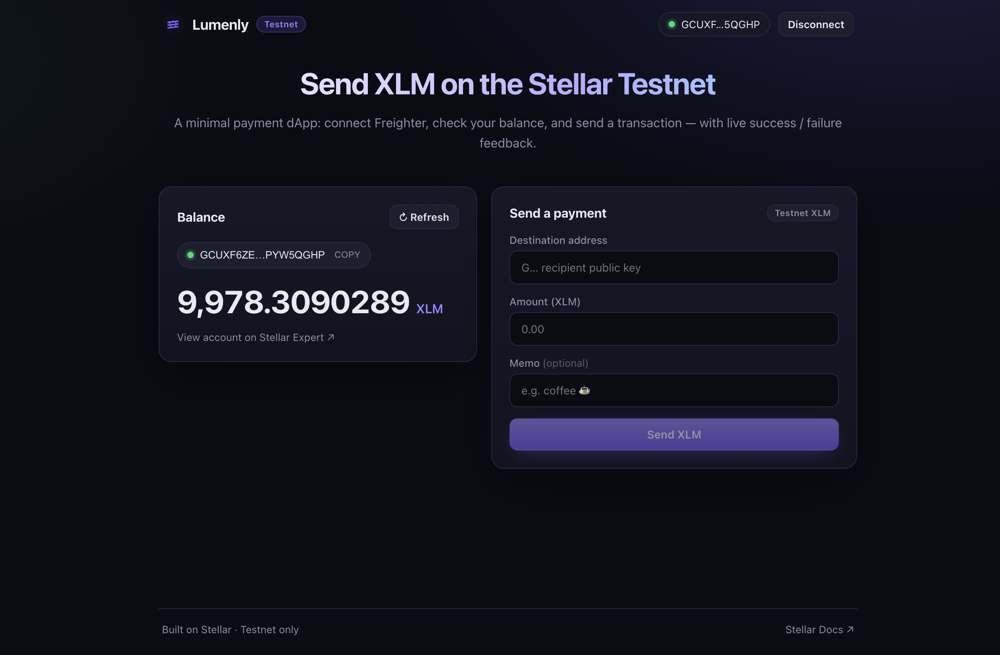
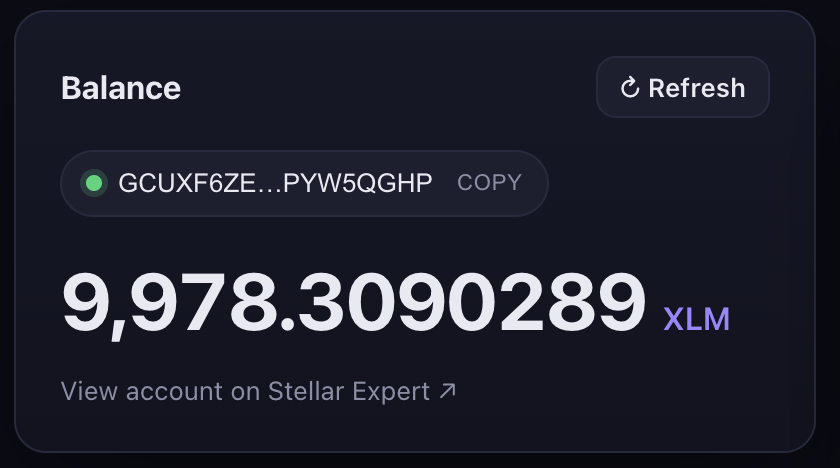
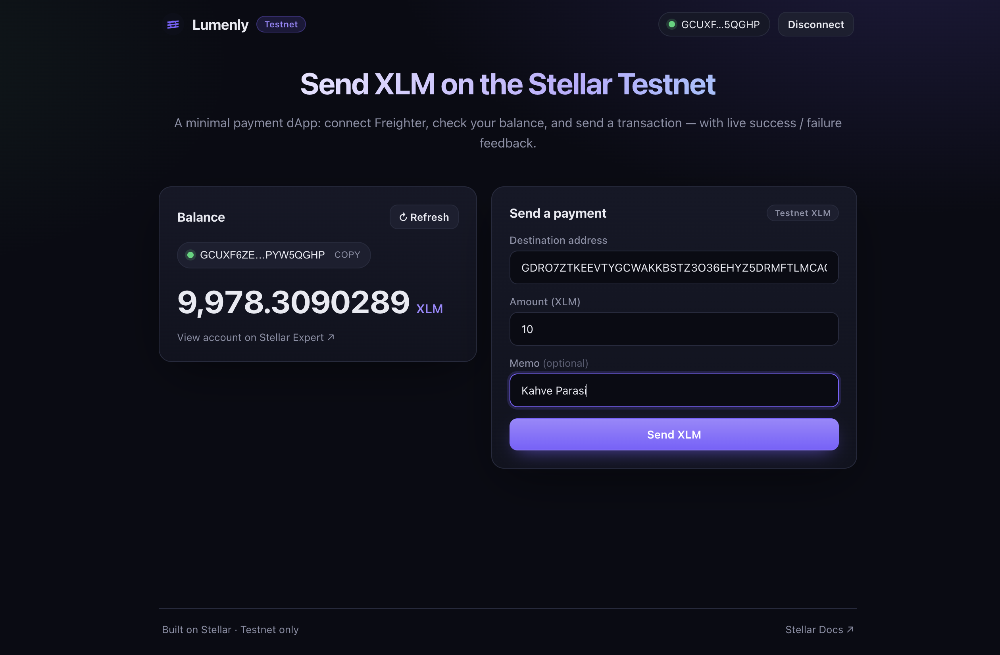
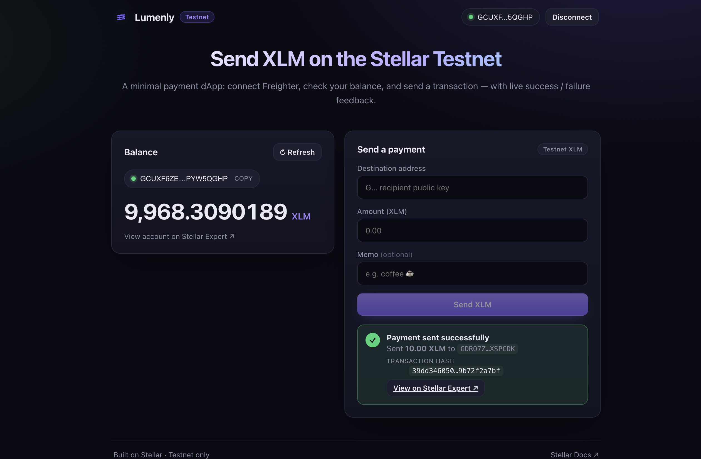

# 🚀 Lumenly — Testnet Payment dApp

> **Level 1 · White Belt submission** — a first working Stellar dApp on Testnet.

A minimal but polished payment dApp built on the **Stellar Testnet**. Connect the
**Freighter** wallet, see your XLM balance, and send a payment to any address —
with clear success / failure feedback and a link to the transaction on the block
explorer. No real funds are ever involved.



---

## ✨ Features

| Requirement | Where it lives |
| --- | --- |
| **Freighter wallet on Testnet** | [`src/lib/freighter.ts`](src/lib/freighter.ts), [`src/lib/network.ts`](src/lib/network.ts) |
| **Wallet connect** | [`connectWallet()`](src/lib/freighter.ts) + [`ConnectPanel`](src/components/ConnectPanel.tsx) |
| **Wallet disconnect** | [`useWallet().disconnect`](src/hooks/useWallet.ts) (Disconnect button in the top bar) |
| **Fetch XLM balance** | [`fetchXlmBalance()`](src/lib/stellar.ts) via Horizon |
| **Display balance** | [`BalanceCard`](src/components/BalanceCard.tsx) |
| **Send XLM transaction** | [`buildPaymentXdr()` → Freighter sign → `submitSignedTransaction()`](src/lib/stellar.ts) |
| **Transaction feedback** | [`TxFeedback`](src/components/TxFeedback.tsx) — success/fail state + tx hash + explorer link |
| **Error handling** | Friendly Horizon result-code messages, address validation, unfunded-account detection |

Extra niceties:

- 🪂 **Friendbot funding** — one click to fund a fresh testnet account with 10,000 XLM.
- 🔍 **Address validation** before you can submit, and a guard against paying yourself.
- ⚠️ **Network guard** — warns if Freighter is pointed at a network other than Testnet.
- 🔗 **Stellar Expert links** for both the account and each transaction.
- 🔄 **Session restore** — reconnects automatically if you already authorised the app.

---

## 🧱 Tech stack

- **React 19** + **TypeScript** + **Vite 7**
- [`@stellar/stellar-sdk`](https://www.npmjs.com/package/@stellar/stellar-sdk) — build & submit transactions, read balances from Horizon
- [`@stellar/freighter-api`](https://www.npmjs.com/package/@stellar/freighter-api) — connect to the Freighter browser extension
- Plain CSS (no UI framework) — custom dark theme

---

## 🛠️ Run it locally

### Prerequisites

1. **Node.js 18+** and npm
2. The **[Freighter](https://www.freighter.app/) browser extension**, with:
   - a wallet created, and
   - the network switched to **Testnet** (Freighter → settings → Network → *Test Net*).

### Setup

```bash
# 1. Clone the repo
git clone https://github.com/<your-username>/<your-repo>.git
cd <your-repo>

# 2. Install dependencies
npm install

# 3. Start the dev server
npm run dev
```

Then open the printed URL (default **http://localhost:5173**).

### Available scripts

| Command | Description |
| --- | --- |
| `npm run dev` | Start the Vite dev server with hot reload |
| `npm run build` | Type-check and build for production into `dist/` |
| `npm run preview` | Serve the production build locally |
| `npm run lint` | Type-check the project (`tsc --noEmit`) |

---

## 🐳 Run with Docker + Make

The project ships with a hardened, multi-stage Docker image (rootless nginx) and
a `Makefile` of shortcuts. Run `make` to see every target.

```bash
make up        # build + run the production container → http://localhost:8080
make dev       # Vite dev server with hot reload in Docker → http://localhost:5173
make logs      # tail logs
make headers   # verify the live security headers
make down      # stop everything
make clean     # remove containers, image and dist/
```

| Target | What it does |
| --- | --- |
| `make up` / `make down` / `make restart` | Production container lifecycle (nginx on `:8080`) |
| `make dev` | Hot-reloading dev server in Docker (`:5173`) |
| `make dev-local` / `make build-local` / `make lint` | Run on the host without Docker |
| `make audit` / `make scan` / `make headers` | Security: npm audit, Trivy image scan, header check |

The production container runs **rootless, read-only, with all Linux capabilities
dropped**, and serves a strict Content-Security-Policy plus a full set of security
headers. See **[SECURITY.md](SECURITY.md)** for the full audit and threat model.

---

## 📖 How to use

1. **Connect** — click **Connect Freighter** and approve the popup.
2. **Fund (first time)** — if the account is new, click **Fund with Friendbot** to
   receive 10,000 testnet XLM, then the balance appears.
3. **Send** — enter a destination `G…` address and an amount, optionally a memo,
   and click **Send XLM**. Approve the signature in Freighter.
4. **Confirm** — on success you get the **transaction hash** and a link to view it
   on Stellar Expert. On failure you get a readable reason.

> Need a second testnet address to send to? Create another account in Freighter,
> or use the [Stellar Laboratory](https://laboratory.stellar.org/#account-creator?network=test).

---

## 🔄 Transaction flow (under the hood)

```
 User input
    │
    ▼
buildPaymentXdr()            ← loads source account from Horizon, builds a
    │  (unsigned XDR)          payment operation (native asset), sets fee & memo
    ▼
signWithFreighter()         ← Freighter prompts the user to sign with the
    │  (signed XDR)            Testnet network passphrase
    ▼
submitSignedTransaction()   ← submits to Horizon, returns the tx hash
    │
    ▼
TxFeedback (success / error) + balance refresh
```

All network configuration is centralised in
[`src/lib/network.ts`](src/lib/network.ts) and hard-wired to **Testnet** so the app
can never touch mainnet funds.

---

## 📸 Screenshots

> Replace these with your own captures (PNG) in `docs/screenshots/`.

| Wallet connected | Balance displayed |
| --- | --- |
|  |  |

| Sending a transaction | Successful result |
| --- | --- |
|  |  |

---

## 📂 Project structure

```
src/
├── App.tsx                  # Page layout & connected/disconnected switch
├── main.tsx                 # React entry + Buffer polyfill for the SDK
├── styles.css               # Dark theme
├── hooks/
│   └── useWallet.ts         # Connection, network & balance state machine
├── lib/
│   ├── network.ts           # Testnet config (single source of truth)
│   ├── freighter.ts         # Freighter wallet wrapper (connect / sign)
│   ├── stellar.ts           # Horizon: balance, build, submit, friendbot
│   └── format.ts            # Address / amount formatting helpers
└── components/
    ├── ConnectPanel.tsx     # Pre-connection landing state
    ├── BalanceCard.tsx      # Balance + address + friendbot funding
    ├── SendForm.tsx         # Payment form + flow orchestration
    └── TxFeedback.tsx       # Success / failure UI
```

---

## ⚠️ Notes

- This app is **Testnet only**. Testnet XLM has no monetary value.
- Freighter has no programmatic "revoke"; **Disconnect** clears the dApp session
  and is **remembered across page refreshes** (so it won't silently reconnect).
  Clicking **Connect** again restores the session. To fully de-authorise, remove
  the app inside the Freighter extension.

---

Built for the Stellar Frontend Challenge · White Belt 🥋
